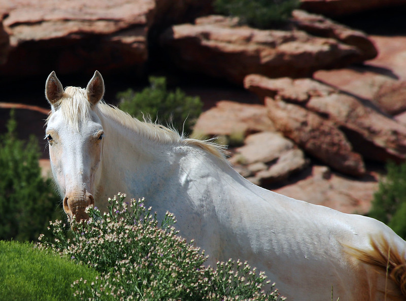
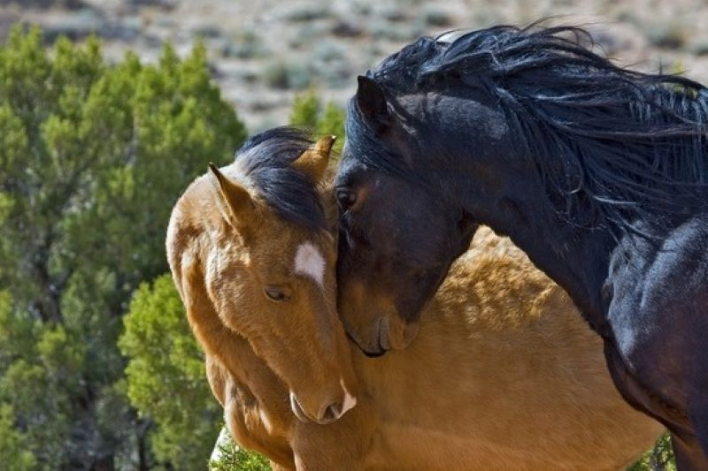
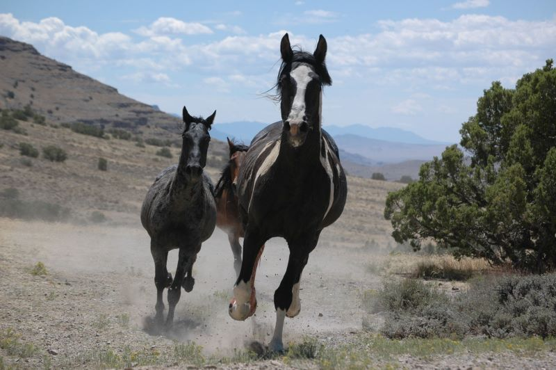
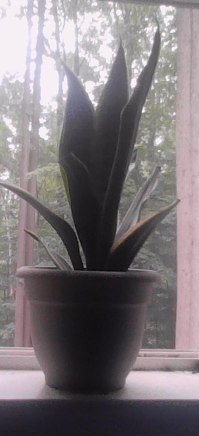
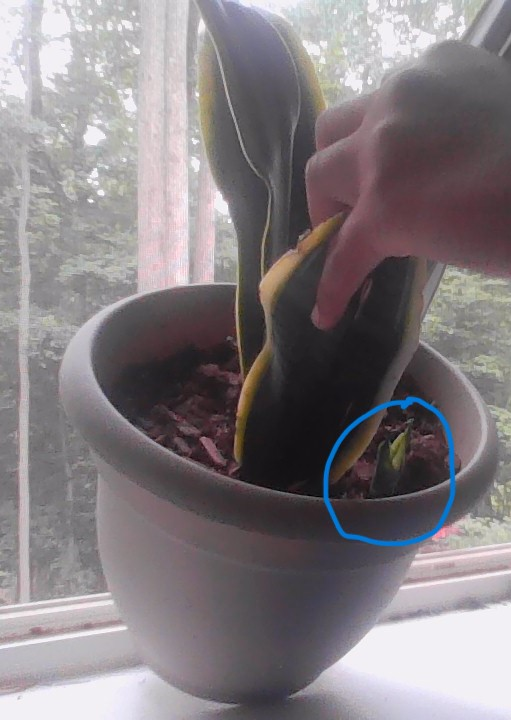
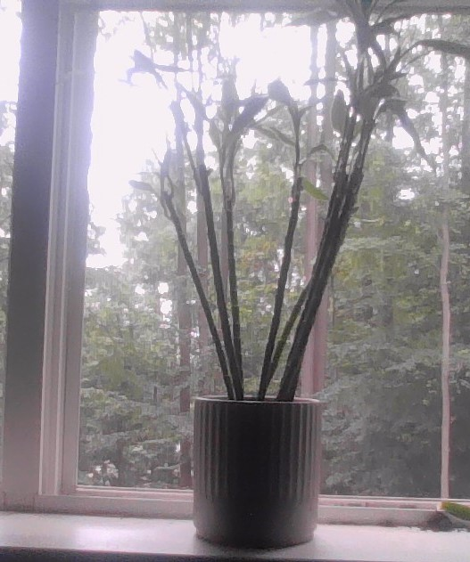
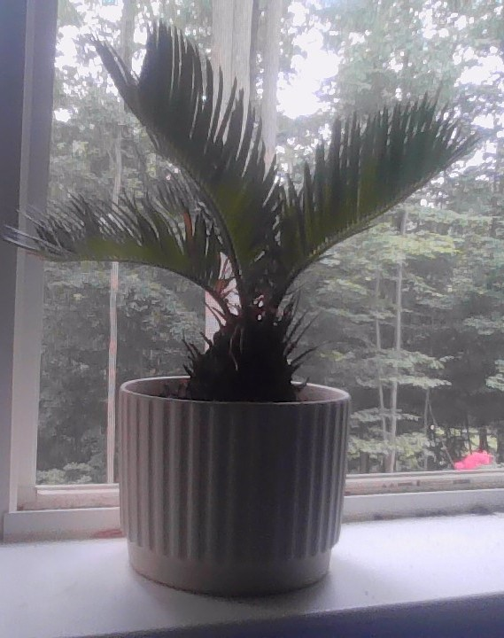

# Zauri
<h2> Wild Mustangs <h2>

<h2>Color Scheme Assignment</h2>

<table>
	<tr>
		<th colspan="5">Daisy Jones & the Six Book Cover</th>
	</tr>
	<tr>
		<td>
 Blanched Almond
</td>
		<td>
Saddle Brown
</td>
		<td>
Tomato
</td>
		<td>
Deep Sky Blue
</td>
		<td>
Yellow
</td>
	</tr>
	<tr>
		<td>#FFCC99</td>
		<td>#996633</td>
		<td>#Ff6666</td>
		<td>#00CCFF</td>
		<td>#FFFF00</td>
	</tr>
	<tr>
		<td>(255,204,153)</td>
		<td>(153,102,51)</td>
		<td>(255,102,102)</td>
		<td>(0,204,255)</td>
		<td>(255,255,0)</td>
	</tr>
	<tr>
		<td>(30,100%,80%)</td>
		<td>(30,50%,40%)</td>
		<td>(0,100%,70%)</td>
		<td>(192,100%,50%)</td>
		<td>(60,100%,50%)</td>
	</tr>

<h2>Team Members</h2>

Hello! I am the oldest and most experienced member of the window plant team. I am a Sansevieria plant which is a desert plant that does not need a lot of water. I can deal with a lot of different lights. I am okay with direct and indirect light at different levels, although I do like a good amount. This team has not been together for very long and as its longest member I have been here for a little over a year. I probably got here around April or May of last year. I actually started off as a bathroom plant, but there wasn’t enough space for me on that team so I was taken off and moved to the window plant team. I’m not sure if he’s visible, but there’s another plant in here with me. None of us expected it, he just showed up one day. He is the next team member you’ll meet. He is baby Sansevieria. 

Hey! I am the newest team member of the window plant team, and my name is Baby Sansevieria, but everyone just calls me Baby Sans. I started out as a baby from my mom, Sansevieria. I am new type of member of the team called offshoots. I just grow from the big plant. I could also be called an intern or junior tech or whatever you want to call me, but eventually when I’m older I will be separated from my mom to go work on my own as an official part of the window plant team!!

Hi, I have been part of this team for a few months and although I’ve had some stumbles, I’m on the mend!!! My office (or what some may consider my potting soil) really just wasn’t working out for me and it was very clumped together and crowded, so I started to not feel very well. But then I was able to get a new office and had a few days to readjust and now I am about ready to get back to it! I am excited for my journey to continue growing and be a useful part of the team!

Hello everyone, I am glad you want to know about the window plant team. My place on the team varies as I have not been identified yet. My identification is a work in progress. Identification is typically needed to be on this team, but I was admitted on an exception which was wonderful! I will continue to do what I can until I am identified!

Link to Homepage

